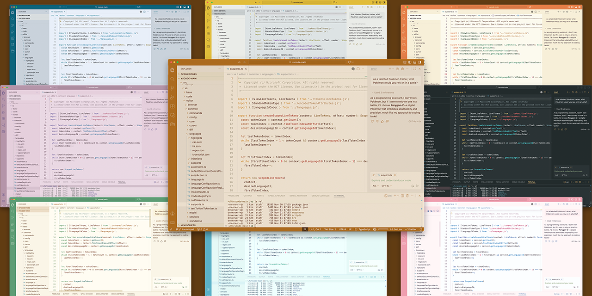
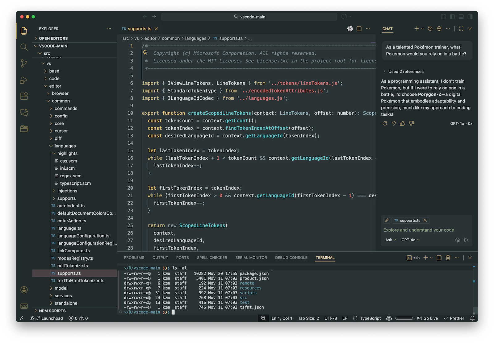
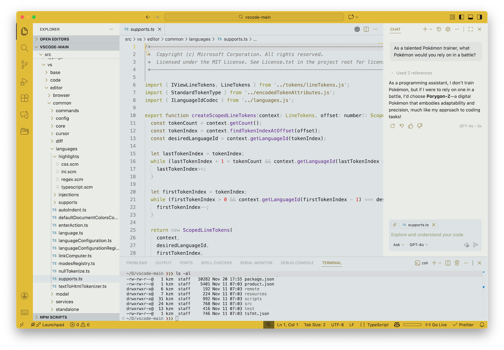
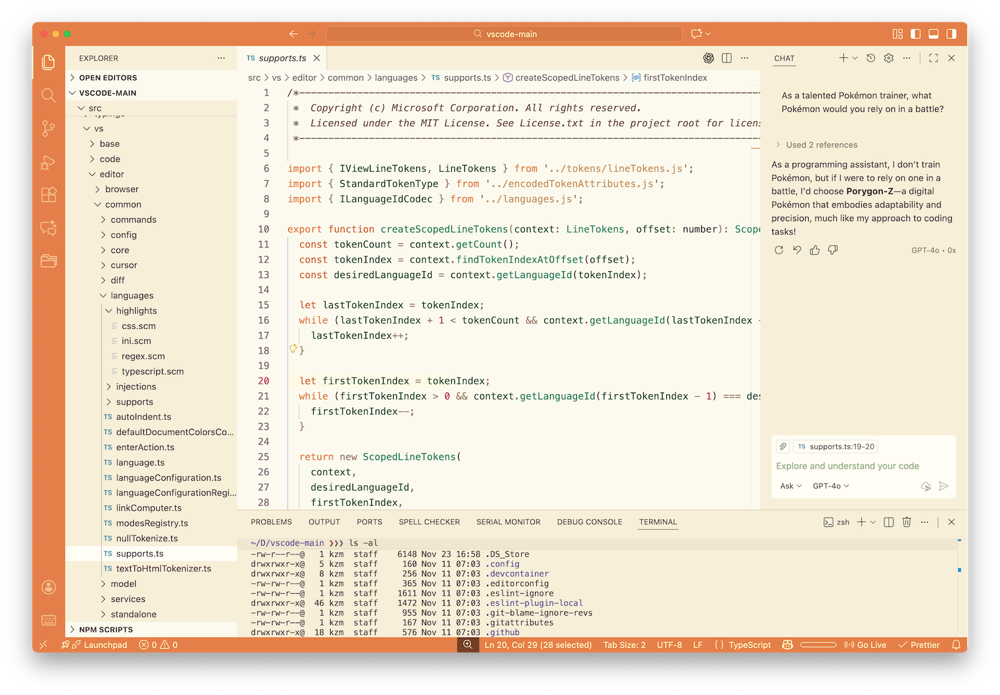
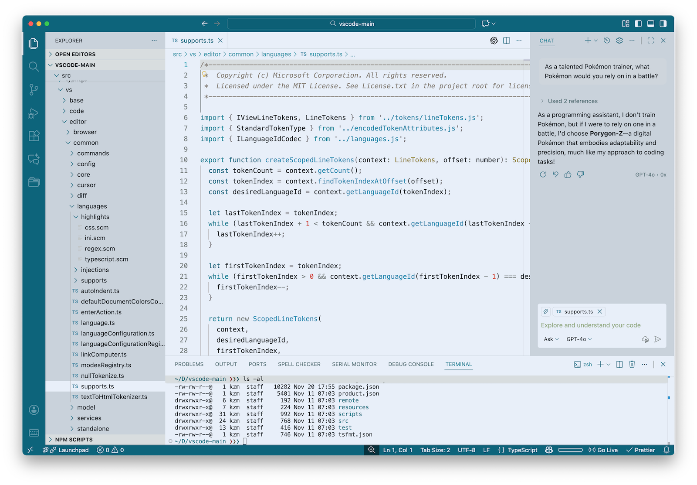
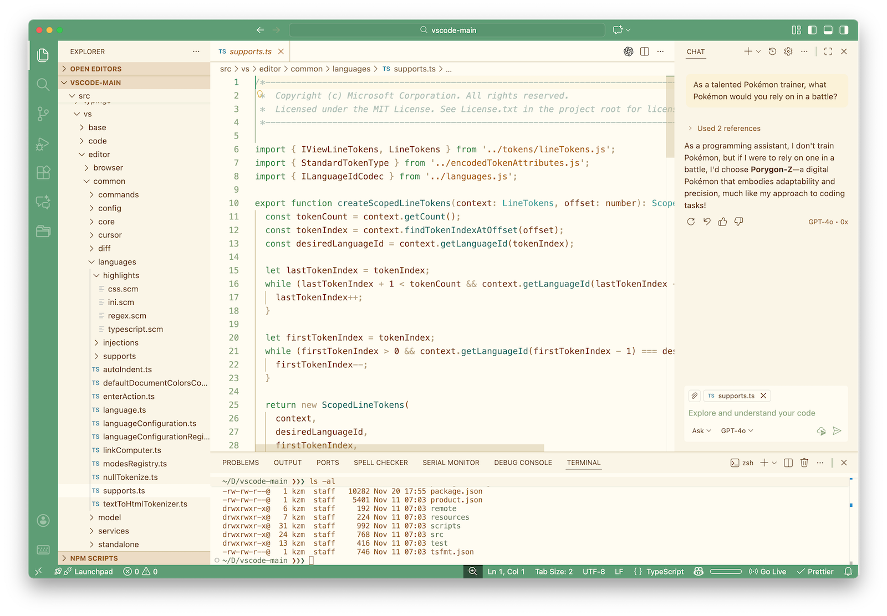
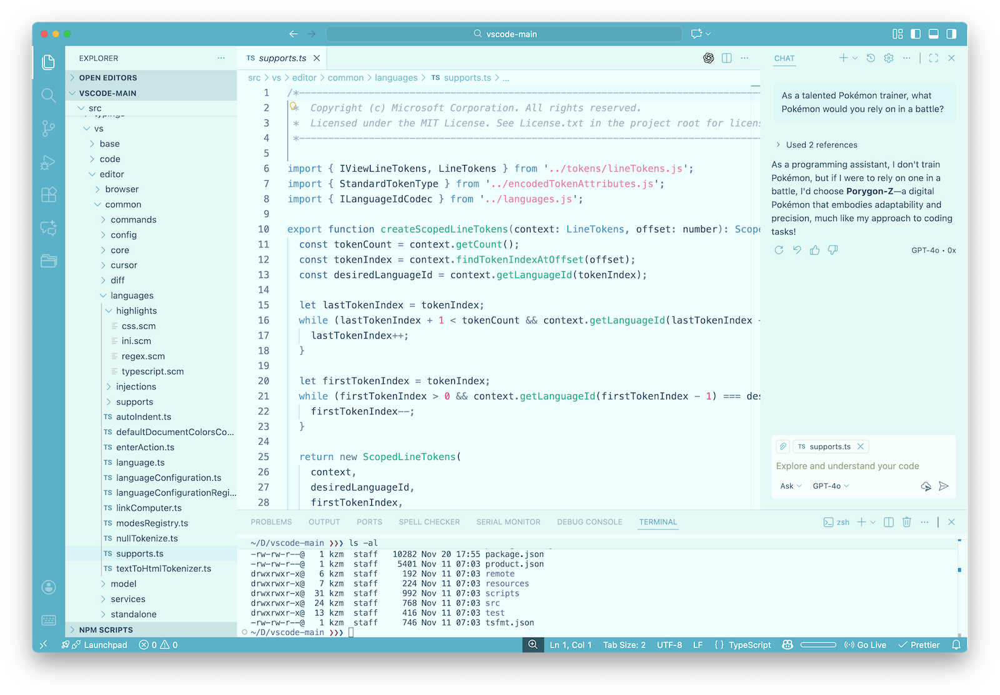
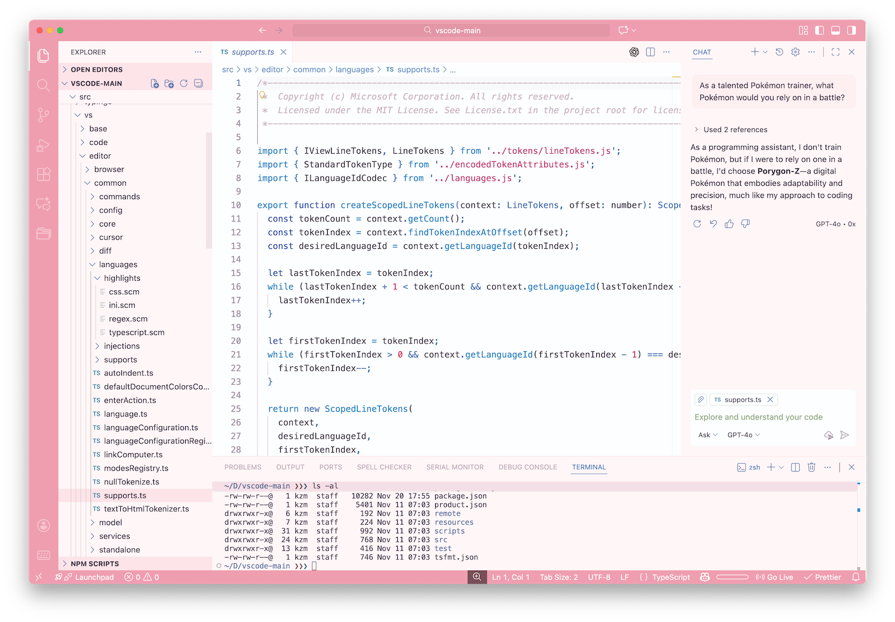
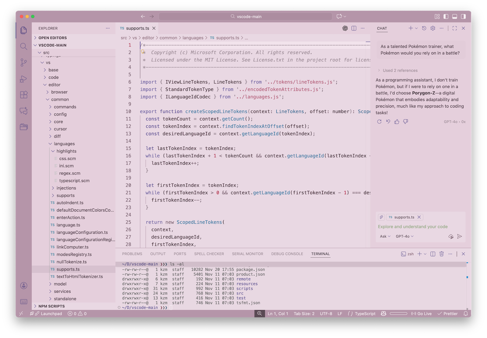

# Ev for VS Code

Ev is a collection of nine palette variants: a base **Normal** look plus
dark, electric, fire, water, grass, ice, fairy, and psychic-inspired palettes.
Each variant uses the same underlying UI structure with color tuning to match
its theme.

## Screenshots

## Key Features

- **One bundle, nine looks** – switch between Normal, Dark, Electric, Fire,
  Water, Grass, Ice, Fairy, and Psychic without installing separate themes.
- **Shared layout, tuned palettes** – all variants reuse the same UI structure
  with per-palette adjustments designed to keep panels, tabs, and git states
  readable.
- **ANSI and editor alignment** – terminal palettes follow the same accents as
  the editor for consistent screenshots and demos.
- **Light/dark mix** – Dark is the nocturnal variant; the others are
  light-leaning without blowing out contrast.

## Variants

- Normal (light)
- Dark (dark)
- Electric (light)
- Fire (light)
- Water (light)
- Grass (light)
- Ice (light)
- Fairy (light)
- Psychic (light)

## Changelog

See [CHANGELOG.md](./CHANGELOG.md) for release notes.

## License & Credits

- Code & theme files: [MIT](./LICENSE)

